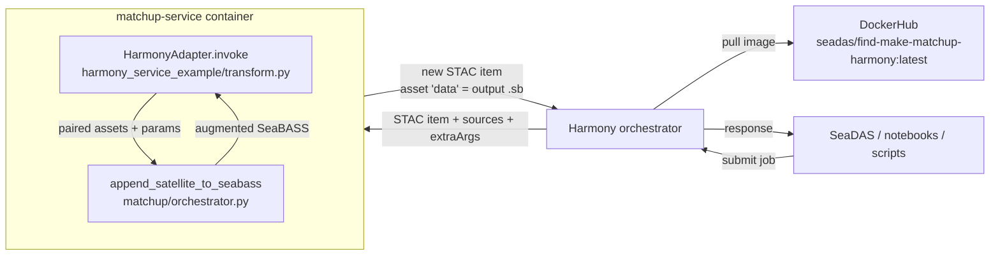
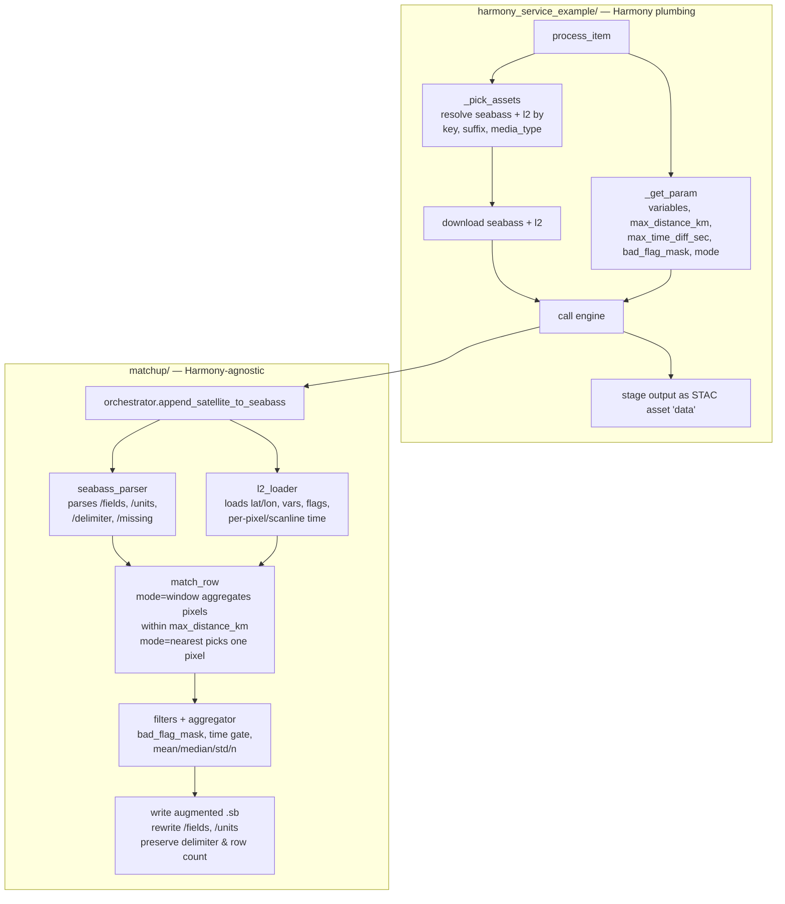
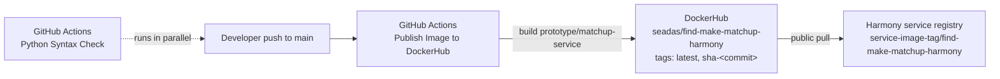

# Architecture (current code)

This is the demo-facing architecture map for the active prototype. It uses
the **current** module names; the older `docs/high_lelel_architecture.md`
and `docs/flow_chart.md` predate the `matchup/` package refactor.

## End-to-end view



## Inside the container — adapter ↔ engine split



**Why the split matters.** The engine has zero Harmony imports.
`run_local_matchup.py` drives the same engine from a CLI, a notebook can
import it directly, and a future non-Harmony service could reuse it. Only
the adapter knows about Harmony messages, STAC, staging, and the service
library.

## Input STAC item shape (what Harmony hands the adapter)

```jsonc
{
  "type": "Feature",
  "stac_version": "1.0.0",
  "id": "<paired-input-id>",
  "assets": {
    "seabass": { "href": "...", "type": "text/plain",        "roles": ["seabass"] },
    "l2":      { "href": "...", "type": "application/x-netcdf", "roles": ["l2"] }
  }
}
// plus Harmony-level:
//   sources[].variables[].name      -> requested satellite variables
//   extraArgs.max_distance_km       -> spatial window
//   extraArgs.max_time_diff_sec     -> temporal window
//   extraArgs.bad_flag_mask         -> integer mask against L2 flags
//   extraArgs.mode                  -> "window" | "nearest"
```

Asset resolution rules (see `_pick_assets`): prefer explicit keys
`seabass` / `l2`; fall back to filename suffix (`.sb`/`.txt`, `.nc`/`.nc4`)
or media-type containing `seabass` / `netcdf`.

## Output STAC item + SeaBASS contract

The adapter returns a fresh STAC item whose **only** asset is `data`
(input assets are intentionally cleared). The `data` asset is a SeaBASS
file with:

- **Same row count** as the input (SeaBASS-centric design).
- Original header preserved; only `/fields=` and `/units=` are rewritten.
- New columns appended per row:
  - `matchup_min_distance_km` &mdash; nearest matched pixel distance
  - `matchup_min_dt_sec` &mdash; nearest matched pixel time delta
  - For each requested variable `<v>`:
    `sat_<v>_mean`, `sat_<v>_median`, `sat_<v>_std`, `sat_<v>_n`

## Deployment pipeline



- Workflow: `.github/workflows/publish-image.yml`
- Auth: `DOCKERHUB_USERNAME` + `DOCKERHUB_TOKEN` repo secrets
- Tags emitted: `latest` (rolling on main), `sha-<long sha>` (immutable),
  and `<version>` on GitHub release publish.
- Bamboo `bin/deploy-service` PUTs the new tag at
  `<harmony-root>/service-image-tag/find-make-matchup-harmony` so the
  Harmony env picks up the new image &mdash; pending the matching entry
  in the Harmony service registry.
