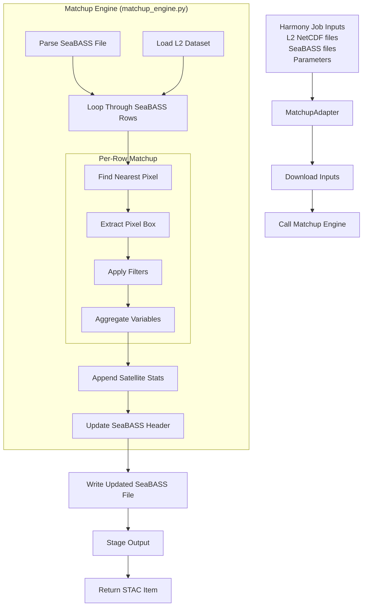

```mermaid

flowchart TD

    %% Harmony Input
    A[Harmony Job Inputs\nL2 NetCDF files\nSeaBASS files\nParameters] --> B[MatchupAdapter]

    %% Adapter
    B --> C[Download Inputs]
    C --> D[Call Matchup Engine]

    %% Engine Steps
    subgraph Engine["Matchup Engine (matchup_engine.py)"]
        E1[Parse SeaBASS File]
        E2[Load L2 Dataset]
        E3[Loop Through SeaBASS Rows]

        subgraph RowMatchup["Per-Row Matchup"]
            F1[Find Nearest Pixel]
            F2[Extract Pixel Box]
            F3[Apply Filters]
            F4[Aggregate Variables]
        end

        E1 --> E3
        E2 --> E3
        E3 --> F1 --> F2 --> F3 --> F4
        F4 --> E4[Append Satellite Stats]
        E4 --> E5[Update SeaBASS Header]
    end

    %% Output
    E5 --> G[Write Updated SeaBASS File]
    G --> H[Stage Output]
    H --> I[Return STAC Item]
```
