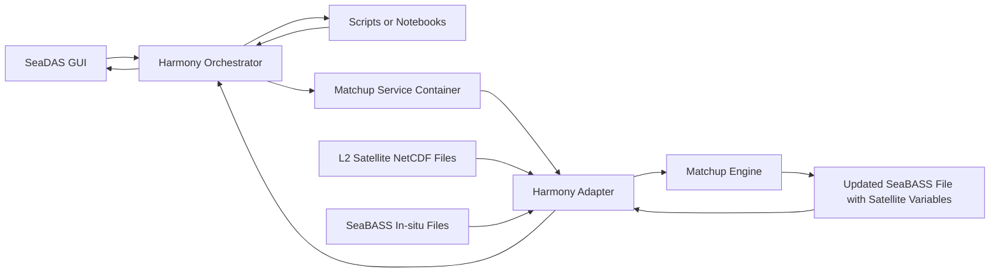

```mermaid

flowchart LR

    Client1[SeaDAS GUI]
    Client2[Scripts or Notebooks]

    Harmony[Harmony Orchestrator]

    Service[Matchup Service Container]
    Adapter[Harmony Adapter]
    Engine[Matchup Engine]

    L2[L2 Satellite NetCDF Files]
    SB[SeaBASS In-situ Files]

    Output[Updated SeaBASS File with Satellite Variables]

    %% Clients submit jobs to Harmony
    Client1 --> Harmony
    Client2 --> Harmony

    %% Harmony invokes the service
    Harmony --> Service

    %% Service uses the adapter
    Service --> Adapter

    %% Adapter reads input data
    L2 --> Adapter
    SB --> Adapter

    %% Adapter calls the engine
    Adapter --> Engine

    %% Engine produces the updated SeaBASS file
    Engine --> Output

    %% Adapter returns result to Harmony
    Output --> Adapter
    Adapter --> Harmony

    %% Harmony returns links / STAC back to clients
    Harmony --> Client1
    Harmony --> Client2


```
