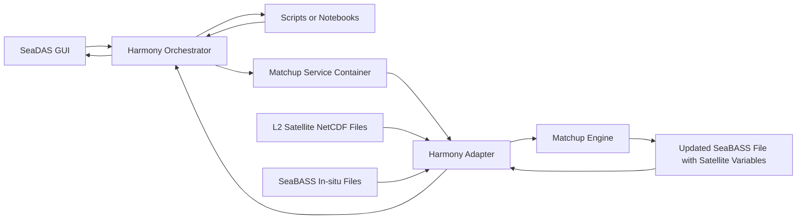
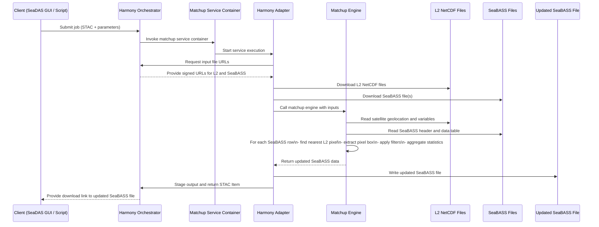

```mermaid

flowchart LR

    Client1[SeaDAS GUI]
    Client2[Scripts or Notebooks]

    Harmony[Harmony Orchestrator]

    Service[Matchup Service Container]
    Adapter[Harmony Adapter]
    Engine[Matchup Engine]

    L2[L2 Satellite NetCDF Files]
    SB[SeaBASS In-situ Files]

    Output[Updated SeaBASS File with Satellite Variables]

    %% Clients submit jobs to Harmony
    Client1 --> Harmony
    Client2 --> Harmony

    %% Harmony invokes the service
    Harmony --> Service

    %% Service uses the adapter
    Service --> Adapter

    %% Adapter reads input data
    L2 --> Adapter
    SB --> Adapter

    %% Adapter calls the engine
    Adapter --> Engine

    %% Engine produces the updated SeaBASS file
    Engine --> Output

    %% Adapter returns result to Harmony
    Output --> Adapter
    Adapter --> Harmony

    %% Harmony returns links / STAC back to clients
    Harmony --> Client1
    Harmony --> Client2


```

```mermaid

sequenceDiagram
    participant Client as Client (SeaDAS GUI / Script)
    participant Harmony as Harmony Orchestrator
    participant Service as Matchup Service Container
    participant Adapter as Harmony Adapter
    participant Engine as Matchup Engine
    participant L2 as L2 NetCDF Files
    participant SB as SeaBASS Files
    participant Output as Updated SeaBASS File

    Client ->> Harmony: Submit job (STAC + parameters)
    Harmony ->> Service: Invoke matchup service container

    Service ->> Adapter: Start service execution

    Adapter ->> Harmony: Request input file URLs
    Harmony -->> Adapter: Provide signed URLs for L2 and SeaBASS

    Adapter ->> L2: Download L2 NetCDF files
    Adapter ->> SB: Download SeaBASS file(s)

    Adapter ->> Engine: Call matchup engine with inputs

    Engine ->> L2: Read satellite geolocation and variables
    Engine ->> SB: Read SeaBASS header and data table

    Engine ->> Engine: For each SeaBASS row\n- find nearest L2 pixel\n- extract pixel box\n- apply filters\n- aggregate statistics

    Engine -->> Adapter: Return updated SeaBASS data

    Adapter ->> Output: Write updated SeaBASS file
    Adapter ->> Harmony: Stage output and return STAC Item

    Harmony -->> Client: Provide download link to updated SeaBASS file
```
